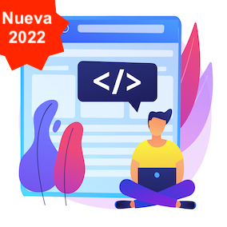
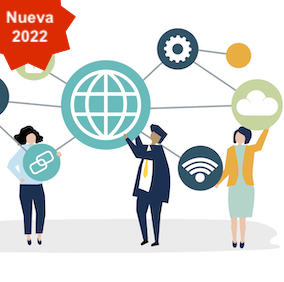
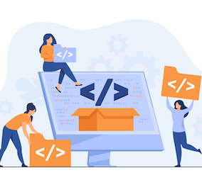

<!-- ***** Preloader Start ***** -->

  

    
    

      
      
      
    

  

<!-- ***** Preloader End ***** -->

<!-- Pre-header Starts -->

<!-- ***** Header Area Start ***** -->
<header class="header-area header-sticky wow slideInDown" data-wow-duration="0.75s" data-wow-delay="0s">
  

    

      

        <nav class="main-nav">
          <!-- ***** Logo Start ***** -->
          
           <!-- ***** Logo End ***** -->
          <!-- ***** Menu Start ***** -->
          <ul class="nav">
            <li class="scroll-to-section"><a href="#top" class="active">Inicio</a></li>
            <li class="scroll-to-section"><a href="#portfolio">Recursos</a></li> 
            <li class="scroll-to-section"><a href="/materias/">Materias</a></li>
            <li class="scroll-to-section"><a href="#contactos">Contactos</a></li>
            <li class="scroll-to-section">
<a href="#services">Nuevas TECNICATURAS</a>
</li>
           
          </ul>        
          <a class='menu-trigger'>
              Menu
          </a>
          <!-- ***** Menu End ***** -->
        </nav>
      

    

  

</header>
<!-- ***** Header Area End ***** -->

  

    

      

        

          

            

              

                

                  <h6>Desde Marzo 2022</h6>
                  <h2>Dos nuevas Tecnicaturas</h2>
                  
UNAHUR lanza dos propuestas formativas nuevas que acompañan la necesidad de profesionales en el sector IT. Con un trayecto académico más corto (2 años y medio), y compatibles con la Licenciatura en Informática. Si ya estás inscripto en la Tecnicatura Universitaria en Informática, también podés oprtar por una de ellas y focalizar tus estudios.

                

                

                  

                    <a href="#about">¿por qué nuevas Tecnicaturas?</a>
                  

                

              

            

          

          

            

              
            

          

        

      

    

  

  

    

      

        

          

            

              
            

          

          

            

              

                <h6>Propuestas</h6>
                <h4>¿Por qué nuevas <em>Tecnicaturas</em>?</h4>
                

              

              
Los nuevos planes de pregrado tienen menor carga horaria. Son más específicos en los <strong style="font-weight: bold;">alcances del título</strong> y requieren una menor dedicación horaria de cursada semanal para que te puedas organizar mejor, sobre todo al inicio de la vida universitaria.

              

                

                  

                    

                      
                        
                      
                      
                        
                      
                      

                        

                          1408 hs 
                          - 25% total
                        

                      

                    

                  

                

                

                  

                    

                      
                        
                      
                      
                        
                      
                      

                        

                          14hs  
                          x semana - 1er cuatri
                        

                      

                    

                  

                

                

                  

                    

                      
                        
                      
                      
                        
                      
                      

                        

                          35 
                          Créditos por actividades
                        

                      

                    

                  

                

              
 
              

                

                

                

                  <a href="#services">Más información...</a>
                

              

            

          

        

      

    

  

  

    

      

        

          <h6>Propuestas Formativas</h6>
          <h4>Carreras de <em>INFORMÁTICA</em></h4>
          

        

      

      

        

          

            

              

                

                  

                    
                 
                      
                      NUEVA: Tecnicatura Universitaria en Programación
                    

                  

                  

                    
                 
                      
                      NUEVA: Tecnicatura Universitaria en Redes y Operaciones
                    

                  

                  

                    

                      
                      Licenciatura en Informática
                    

                  

                  

                    
                 
                      
                      Tecnicatura Universitaria en Informática
                    

                  

                

              
 
              

                <ul class="nacc">
                  <li class="active">
                    

                      

                        

                          

                            

                              <h4>NUEVA: Tecnicatura Universitaria en Programación</h4>
                              
Tiene por objetivo formar técnicos/as capaces de elucidar e implementar soluciones en un amplio espectro de problemas realizando tareas de diseño, programación y desarrollo de software.

                              
<i class="fa fa-check"></i> Bases de datos <i class="fa fa-check"></i> Back-end <i class="fa fa-check"></i> Front-end
                                <i class="fa fa-check"></i> Diseñar, codificar <i class="fa fa-check"></i> Probar, medir y mantener programas <i class="fa fa-check"></i> Implantación de proyectos de software

                              
Los/las profesionales serán capaces de Comprender adecuadamente la pertinencia de construir software de acuerdo a varios parámetros de calidad y alorar la conveniencia de utilizar estándares abiertos y software libre en los entornos operativos y herramientas de desarrollo.

                            

                          

                          

                            

                              
                            

                          

                        

                      

                    

                  </li>
                  <li>
                    

                      

                        

                          

                            

                              <h4>NUEVA: Tecnicatura Universitaria en Redes y Operaciones Informáticas</h4>
                              
La carrera tiene por objetivo formar técnicos/as capaces de elucidar e implementar soluciones en un amplio espectro de problemas asociados a la conectividad, servicios de apoyo al desarrollo y despliegue de aplicaciones, y configuración de arquitecturas para la integración continua de sistemas informáticos.

                              
<i class="fa fa-check"></i> DevOps <i class="fa fa-check"></i> Redes Avanzadas <i class="fa fa-check"></i> Servicios en la nube
                                <i class="fa fa-check"></i> Contenedores <i class="fa fa-check"></i> Conectividad <i class="fa fa-check"></i> Integración continua

                              
Las/los profesionales tendrán sólidas bases para formar parte de equipos de Gestión Informática. Serán capaces de comprender adecuadamente la pertinencia de realizar las tareas bajo diferentes parámetros de calidad, entre los que destacamos: claridad, mantenimiento, robustez frente a fallos, uso eficiente de recursos y de la energía. Dispondrán de parámetros para valorar y tener en cuenta los conceptos de estándares abiertos y software libre en los entornos operativos.

                            

                          

                          

                            

                              
                            

                          

                        

                      

                    

                  </li>
                  <li>
                    

                      

                        

                          

                            

                              <h4>Licenciatura en Informática</h4>
                              
La Licenciada o Licenciado en Informátic	cuenta con una base conceptual sólida que le permite resolver problemas y liderar proyectos de desarrollo de software y aplicaciones de distinta índole y magnitud, tanto en el rol de líderes de equipos o en consultoría. Además, puede intervenir en procedimientos periciales y capacitar en diferentes niveles educativos. Así mismo, integrar y dirigir proyectos de investigación.

                              
<i class="fa fa-check"></i>Arquitectura de Software <i class="fa fa-check"></i>Computación de alto desempeño <i class="fa fa-check"></i>Inteligencia Artificial
                                <i class="fa fa-check"></i> Data Info <i class="fa fa-check"></i>Ingeniería de Software <i class="fa fa-check"></i>Sistemas en tiempo real - IoT

                              
Esta carrera de grado tiene entre sus activiades reservadas la de especificar, proyectar y desarrollar sistemas de información, sistemas de comunicación de datos y software cuya utilización pueda afectar la seguridad, salud, bienes o derechos.

                            

                          

                          

                            

                              
                            

                          

                        

                      

                    

                  </li>
                  <li>
                    

                      

                        

                          

                            

                              <h4>Tecnicatura Universitaria en Informática</h4>
                              
La carrera tiene por objetivo formar técnicos/as capaces de elucidar e implementar soluciones en un amplio espectro de problemas asociados a las tareas de diseño/programación dentro del desarrollo de software, en un alcance razonable para un egresado/a pre-universitario, siendo capaces de aprovechar los conceptos aprehendidos en la carrera para pensar y resolver situaciones concretas, y basados en una amplia experiencia practica obtenida durante el recorrido de la carrera.

                              
<i class="fa fa-check"></i>Desarrollo <i class="fa fa-check"></i>Redes <i class="fa fa-check"></i>Back-end
                                <i class="fa fa-check"></i>Front-end <i class="fa fa-check"></i>Bases de datos <i class="fa fa-check"></i>Tecnologías Web

                              
Desde 2022 esta tecnicatura no recibirá nuevos inscriptos ya que las nuevas propuestas permiten una elección más específica. No obstante, el título y el plan de estudios sigue activo para quienes continúen cursando.

                            

                          

                          

                            

                              
                            

                          

                        

                      

                    

                  </li>
                </ul>
              
        
            

          

        

      

    

  

  

    

      

        

          <h6>Recursos</h6>
          <h4>Analizá los planes y <em>Comparalos</em></h4>
          

        

      

    

  

  

    

      

        

          

            <a href="/planilla-comparativa/">
              

              

                
              

              

                <h4>Planilla Comparativa</h4>
                Esta planilla de cálculo te permite ver cómo aplican las materias que tenés aprobadas en cada plan
              

            

            </a>  
          

          

            <a href="/tecnicatura-programacion/">
              

              

                
              

              

                <h4>Tecnicatura Universitaria en Programación</h4>
                Focalizada en desarrollar el pensamiento computacional y los conocimientos para las necesidades de programación de la actualidad.
              

            

            </a>  
          

          

            <a href="/tecnicatura-redes-operaciones/">
              

              

                
              

              

                <h4>Tecnicatura Universitaria en Redes y Operaciones</h4>
                Orientada a formar profesionales DevOps que forman parte del ecosistema del desarrollo de software.
              

            

            </a>  
          

          

            <a href="/licenciatura-informatica/">
              

              

                
              

              

                <h4>Licenciatura en informática</h4>
                Equivalencias con las Tecnicaturas: acá te mostramos cómo se obtienen materias de la Licenciatura cursando las tecnicaturas.
              

            

            </a>  
          

          

            <a href="/tecnicatura-informatica/">
              

              

                
              

              

                <h4>Tecnicatura Universitaria en Informática</h4>
                Una tecnicatura con mayor carga horaria, que abordar principalmente la problemática de desarrollo de software.
              

            

            </a>  
          

        

      

    

  

  

    

      

      

      

        <a href="#free-quote">Cambiar de plan...</a>
      

    

  

  

    

      

        

          <h6>DETALLES DE LAS PROPUESTAS</h6>
          <h4>Revisá la <em>Documentación</em></h4>
          

        

      

      

        

          

            
          

          

            Video
            Febrero 2022
            <a href="#"><h4>¿Cómo son y cómo podés sumarte a las nuevas Tecnicaturas?</h4></a>
            
En este corto video te resumimos los alcances de los títulos y cómo podés hacer para inscribirte en alguno de ellos.

            Informática UNAHUR
            
<a href="/video/">Ver el video</a>

          

        

      

      

        

          

            

              

                

                  
                

                

                  PRESENTACIÓN
                  Febrero 2022
                  <a href="/planes/"><h4>Breve repaso de lo más importante</h4></a>
                  
En esta presentación te damos alguna data y respondemos las preguntas más importantes que seguramente te estás haciendo.

                

              

            

            

              

                

                  
                

                

                  Materias
                  Febrero 2022
                  <a href="#"><h4>Materias del primer cuatrimestre</h4></a>
                  
Te contamos en este apartado cómo se organizan ahora las materias del primer cuatrimestre. Y si ya las cursaste y aprobaste, cómo impactan en los nuevos planes.

                

              

            

            

              

                

                  
                

                

                  Ingresantes 2022
                  Febrero
                  <a href="#"><h4>Cómo aplican las nuevas Tecnicaturas en los ingresantes</h4></a>
                  
Como ingresantes 2022 tendrás la posibilidad de optar por una de las dos tecnicturas en el momento de inscripción durante el CPU. Te contamos más detalles acá.

                

              

            

          

        

      

    

  

  

  

    

      

        

          <h6>Elegí tu plan</h6>
          <h4>Quiero Cambiarme de Tecnicatura</h4>
          

        

      

      

        <form id="search" action="/cambio-plan/" method="GET">
          

            

              
Es un proceso simple.

            

            

              
Completás un formulario y listo.

            

            

              <fieldset>
                <button class="main-button">Solicitar cambio</button>
              </fieldset>
            

          

        </form>
      

    

  

  

    

      

        

          <h6>CONTACTOS</h6>
          <h4>La comunidad de informática tiene estas <em>Redes</em></h4>
          

        

      

      

        <form id="contact" action="" method="post">
          

            

              

                
              

            

            

              

                

                  

                    

                      

                        
                        <a href="https://discord.gg/tqyHtPt" target="_blank">Canal Telegram</a>
                      

                    

                  

                  

                    

                      

                        
                        <a href="https://t.me/joinchat/AAAAAFaVfVC8RaEkQhQdhg" target="_blank">Canal Telegram</a>
                      

                    

                  

                  

                    

                      

                        
                        <a href="#">informatica@unahur.edu.ar</a>
                      

                    

                  

                  

                    

                      

                        
                        <a href="https://www.youtube.com/channel/UCNkrQDISXSSVs-fnQ9MnqEg" target="_blank">Canal de Youtube</a>
                      

                    

                  

                 
                

              

            

          

        </form>
      

    

  

